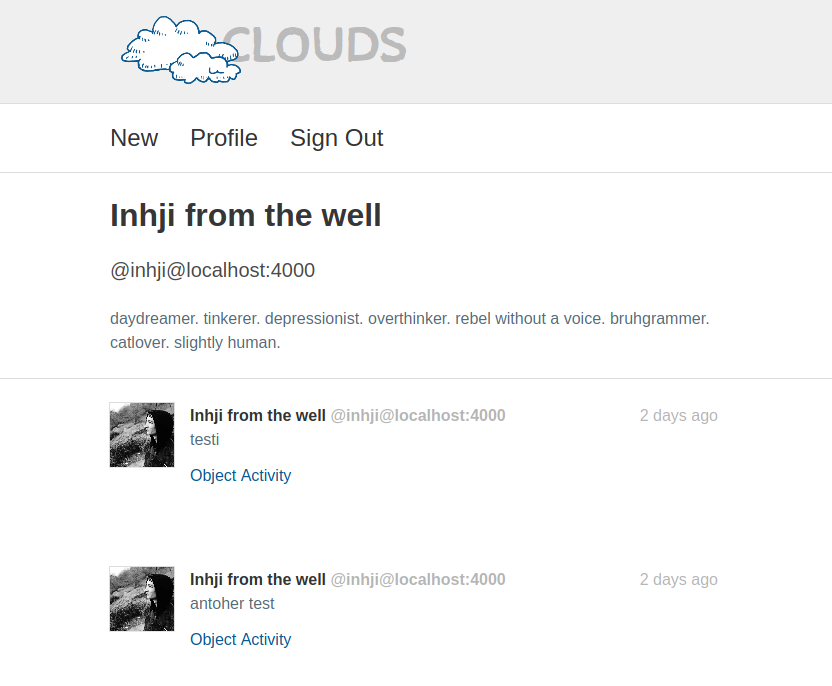

# Clouds
Clouds is my attempt at a single user fediverse/indieweb instance. It will be powered by ActivityPub, Micropub and Webmentions. The name comes from the [Eurorack Module](https://mutable-instruments.net/modules/clouds/) by [Mutable Instruments](https://mutable-instruments.net/) of the same name, which is probably the most fun module there is!

- [ ] Microformats2 markup of posts
- [ ] ActivityPub Server2Server
- [ ] Webmention sending
- [ ] Publish through Micropub
- [ ] Bookmarks!
- [ ] Simple Blog (= Articles)
- [ ] ActivityPub Client support (= Tusky)

